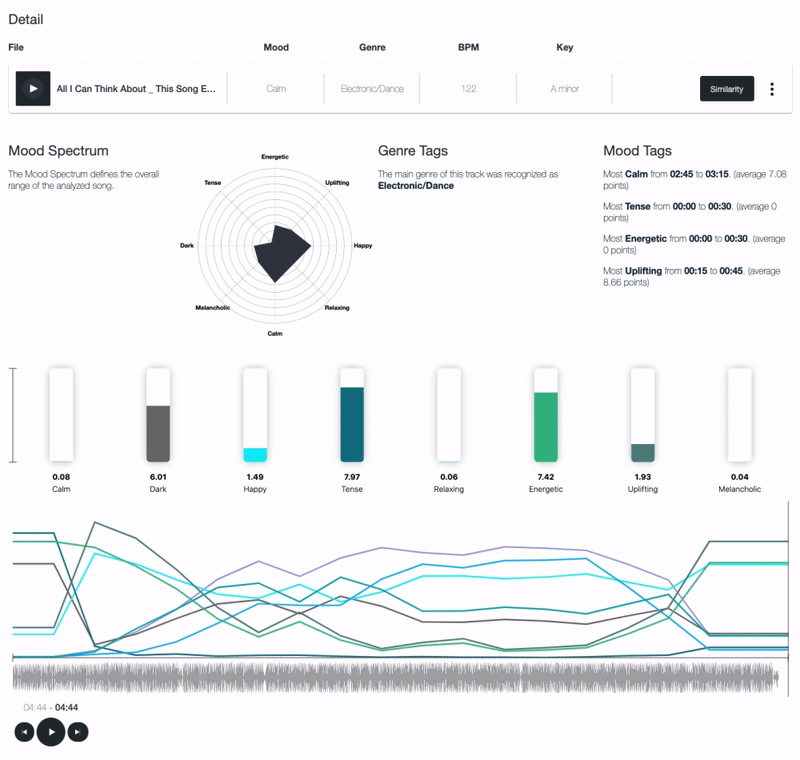

## DocChat  
DocChat is an AI-powered Document Summarization and Chatbot System designed to automate the extraction, cleaning, and summarization of text from various document formats. Built using state-of-the-art machine learning models, it provides a robust solution for interacting with uploaded documents through a user-friendly chatbot interface.  
-   
- Tags: LLM
- Badges:  
  - AI [blue]  
  - NLP [purple]  
  - Chatbot [teal]  
  - Text Summarization [orange]  
  - Machine Learning [green]  
- Buttons:  
  - Link [https://github.com/SushainDevi/DocChat]  

## Music-Recommendation-SpotifyAPI  
This repository contains code for a music recommendation system that utilizes the Spotify API to extract music data and provide personalized recommendations based on user input. The system employs a hybrid approach, combining content-based filtering and popularity-based scoring to generate relevant recommendations.  
-   
- Tags: RecommendationEnginesandMore
- Badges:  
  - Music [red]  
  - Recommendation System [cyan]  
  - Spotify API [green]  
  - Machine Learning [purple]  
- Buttons:  
  - Link [https://github.com/SushainDevi/Music-Recomendation-SpotifyAPI]  

## TextToVideo-Model  
This project implements a text-to-video generation system using deep learning techniques. It creates videos based on textual prompts by generating sequences of images that depict moving shapes, specifically circles, in various directions and transformations.  
-   
- Tags: GenAI 
- Badges:  
  - Deep Learning [red]  
  - AI [blue]  
  - Video Generation [orange]  
  - Text-to-Video [pink]  
- Buttons:  
  - Link [https://github.com/SushainDevi/TextToVideo-Model]  
