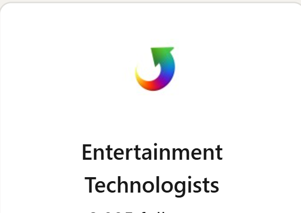
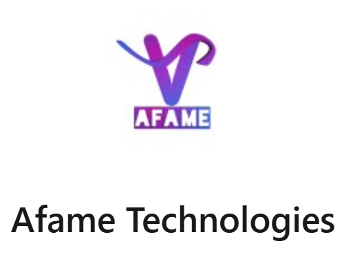

## Entertainment Technologists
- * AI Developer Intern * | July'24 - Dec'24
- 
- Tags: Intern
- Badges:
  - AI [blue]  
  - NLP [purple]  
  - Chatbot [teal]  
  - Text Summarization [orange]  
  - Machine Learning [green]  
  - Deep Learning [red]
- List Items:
  - Designed and implemented solutions to automate the processing of legal documents in the movie  industry.
  - Utilized advanced Natural Language Processing (NLP) techniques for text extraction, keyword and key phrase identification, and text summarization.

## Afame Technologies
- *Machine Learning Intern * | April'24 - May'24
- 
- Tags: Intern
- Badges:
  - Spam Detection [red]
  - Machine Learning [green]
  - SMS [gray]
  - Open AI [cyan]
- List Items:
  - Engaged in a pivotal project focused on refining SMS detection algorithms.
  - Achieved a 15% enhancement in model accuracy through collaborative efforts.